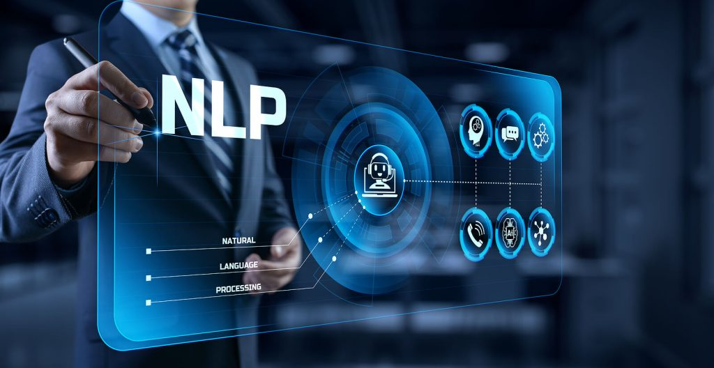

# NLP_Img2txt

The practical apply in NLP image turn to text   
The vexing part about Document Parsing is that there are so many tools for different types of data (text, figures, tables) and none of them works perfectly.Here’s the current framework of the most popular packages based on the strategy one wants to follow:

#### Processing documents as Text: extract text with PyPDF2, extract tables with Camelot or TabulaPy, extract figures with PyMuPDF.
#### Converting documents into Image (OCR): conversion with pdf2image, extract data with PyTesseract plus many other supporting libraries, or just LayoutParser.

## Content : 
- 1.Extract text form PDF(01)
- 2.Devide Paragraph(02)
- 3.Attachment(03)
- 4.Crypt(04)

### Install : PyPDF2 & PDFMiner: 
- $pip install PyPDF2 (pip install PyPDF2[crypto] : For crypto)
- $pip install pdfminer

### 1.PDF to text 
- Program : 
    - [PyPDF2 CV PDF](./01_PDFtext2txt_csv/PYPDF2.py)
    - [PyPDF2 Alibaba PDF](./01_PDFtext2txt_csv/PYPDF2.py)
    - [PDFMiner CV PDF ](./01_PDFtext2txt_csv/PDFMiner.py)

- Result : 
    - [PDFMiner CV PDF txt](./data/testing/output/PDFMiner_20221129CV.txt)
    - [PyPDF2 CV PDF txt](./data/testing/output/PyPDF2_20221129CV.txt)
    - [PyPDF2 Alibaba PDF txt](./data/Wizpresso/output/PyPDF2_file.txt)

### 2.Devide Paragraph : 
    - [PyPDF2 Devide_Paragrph](./02_Paragraph_Devide/PyPDF2_pdfplumber.py)

### 3.Attachment 
    - [Program : PyPDF2 CV PDF](./03_Attachment/PyPDF2_attachment.py)
    - [Result : PyPDF2 CV PDF](./data/testing/output/PyPDF2_attachment.txt)

### 4.Encrypt/Decrypte PDF with customize Password
- Program : 
    - [PyPDF2 encrypt PDF](./04_Crypt/PyPDF2_encryptPDF.py)
    - [PyPDF2 Decrypt PDF](./04_Crypt/PyPDF2_DecryptPDF.py)

- Result : 
    - [PyPDF2 encrypt PDF Result](./data/testing/output/03_Encrypt_David_CV.pdf) #Password : 820224
    - [PyPDF2 encrypt PDF Result](./data/testing/output/03_Decrypt_David_CV.pdf) #Password : 820224

### Reference
- [PyPDF2 Document](https://pypdf2.readthedocs.io/en/latest/)  
- [PyPDF2 Apply](https://nanonets.com/blog/pypdf2-library-working-with-pdf-files-in-python)  
- [PyPDF2 PDF Annotations](https://pypdf2.readthedocs.io/en/latest/user/reading-pdf-annotations.html)  
- [Devide Paragraph by Python re](https://docs.python.org/zh-tw/3.8/library/re.html)
- [PDFMiner Document](https://pdfminer-docs.readthedocs.io/programming.html#performing-layout-analysis)  
